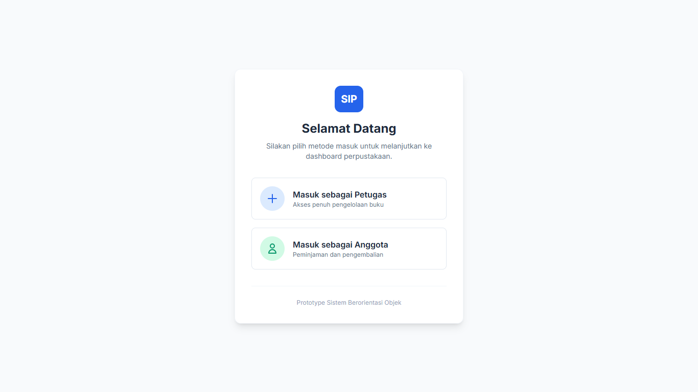
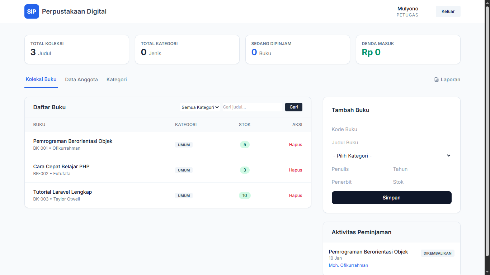
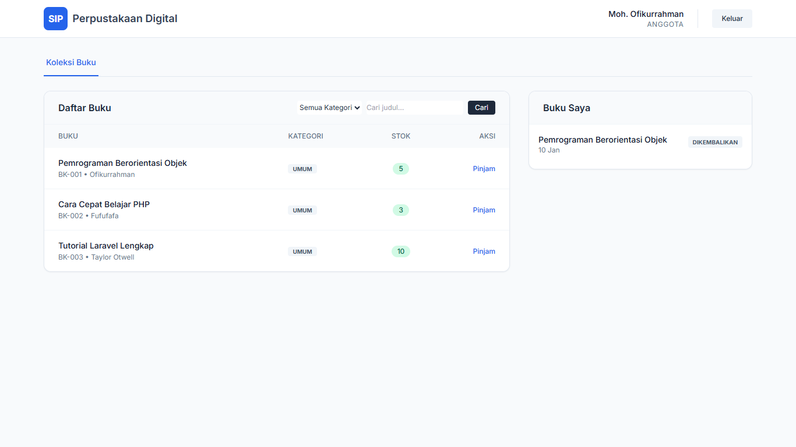
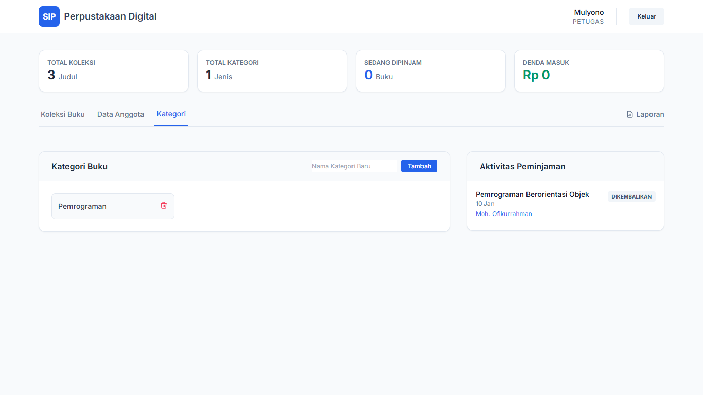
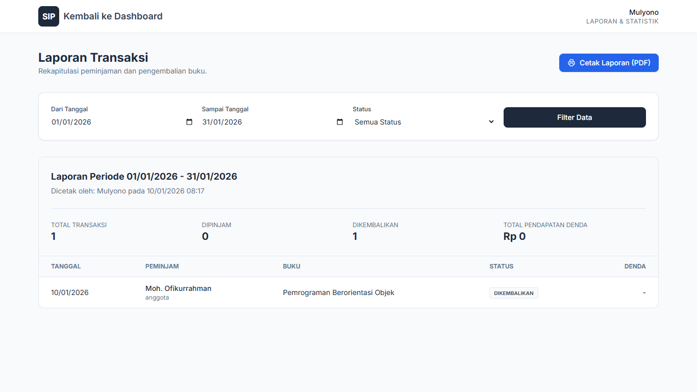

# Sistem Informasi Perpustakaan (SIP)


Sistem Informasi Perpustakaan berbasis web yang dirancang dengan pendekatan **Object-Oriented Programming (OOP)** dan **Class-Based Design**. Proyek ini merupakan implementasi teknis dari jurnal *"Perancangan Sistem Perpustakaan Berorientasi Objek Dengan Pendekatan Class-Based Design"*.

Sistem ini memfasilitasi pengelolaan sirkulasi buku (peminjaman dan pengembalian), manajemen stok buku, manajemen anggota, perhitungan denda otomatis, serta pelaporan statistik.

---

## 📸 Antarmuka Sistem (Screenshots)

Berikut adalah tampilan antarmuka utama sistem yang telah dikembangkan.

### 1. Halaman Login (Gerbang Masuk)
Halaman awal yang membedakan akses untuk Petugas dan Anggota sesuai peran pengguna.


### 2. Dashboard Admin (Petugas)
Pusat kontrol untuk petugas yang menampilkan statistik perpustakaan (Total Koleksi, Anggota, Transaksi, dan Pendapatan Denda) serta navigasi manajemen.


### 3. Dashboard Anggota
Tampilan khusus anggota untuk menelusuri katalog buku, melihat ketersediaan stok, dan memantau status peminjaman pribadi.


### 4. Manajemen Buku & Kategori
Fitur pengelolaan data buku yang mencakup *Create, Read, Update, Delete* (CRUD), serta filter berdasarkan kategori dan pencarian judul.


### 5. Laporan & Statistik
Modul pelaporan yang memungkinkan petugas memfilter data transaksi berdasarkan periode tanggal dan status, serta mencetaknya dalam format laporan resmi.


---

## 🚀 Fitur Utama

Sistem ini mencakup seluruh kebutuhan fungsional (KF) yang didefinisikan dalam perancangan sistem:

1.  **Multi-Role Authentication**:
    * **Petugas (Admin)**: Akses penuh ke manajemen data dan laporan.
    * **Anggota**: Akses terbatas untuk melihat katalog dan riwayat peminjaman pribadi.
2.  **Manajemen Koleksi Buku (KF-01)**:
    * CRUD Data Buku.
    * Manajemen Kategori Buku.
    * Pencarian Buku (Search) berdasarkan judul/penulis.
3.  **Manajemen Anggota (KF-02)**:
    * Registrasi anggota baru.
    * Hapus data anggota.
4.  **Sirkulasi (KF-03 & KF-04)**:
    * **Peminjaman**: Validasi stok otomatis (Stok berkurang saat dipinjam).
    * **Pengembalian**: Stok kembali otomatis.
    * **Sistem Denda**: Perhitungan otomatis denda keterlambatan (Rp1.000/hari setelah 7 hari).
5.  **Laporan & Statistik**:
    * Dashboard statistik real-time.
    * Laporan riwayat transaksi dengan filter tanggal.
    * Mode cetak laporan (Print-friendly UI).

---

## 🛠️ Teknologi yang Digunakan

* **Backend**: Laravel 12 (PHP Framework).
* **Frontend**: Blade Templates, Tailwind CSS (via CDN), Alpine.js.
* **Database**: MySQL.
* **Konsep**: MVC (Model-View-Controller) & OOP Class-Based Design.

---

## 📦 Panduan Instalasi

Ikuti langkah-langkah berikut untuk menjalankan proyek di komputer lokal Anda:

### Prasyarat
* PHP >= 8.2
* Composer
* MySQL / MariaDB

### Langkah Instalasi

1.  **Clone Repositori** (Atau ekstrak file zip)
    ```bash
    git clone https://github.com/ofikur/perpustakaan-ku.git
    cd perpustakaan-ku
    ```

2.  **Install Dependencies**
    ```bash
    composer install
    ```

3.  **Konfigurasi Environment**
    Salin file `.env.example` menjadi `.env`.
    ```bash
    cp .env.example .env
    ```
    Buka file `.env` dan sesuaikan konfigurasi database:
    ```env
    DB_CONNECTION=mysql
    DB_HOST=127.0.0.1
    DB_PORT=3306
    DB_DATABASE=db_perpustakaan
    DB_USERNAME=root
    DB_PASSWORD=
    ```

4.  **Generate Key Aplikasi**
    ```bash
    php artisan key:generate
    ```

5.  **Migrasi Database & Seeder**
    Jalankan perintah ini untuk membuat tabel dan mengisi data dummy awal.
    ```bash
    php artisan migrate --seed
    ```

6.  **Jalankan Server**
    ```bash
    php artisan serve
    ```

7.  **Akses Aplikasi**
    Buka browser dan kunjungi: `http://127.0.0.1:8000`

---

## 🔑 Akun Demo

Untuk memudahkan pengujian, sistem telah menyediakan fitur **Quick Login** pada halaman utama, namun berikut adalah kredensial yang tersimpan di database (Seeder):

| Role | Email | Password | Fitur |
| :--- | :--- | :--- | :--- |
| **Petugas** | `admin@gmail.com` | `123` | Kelola Buku, Kategori, Anggota, Laporan |
| **Anggota** | `ofik@student.com` | `123` | Pinjam Buku, Lihat Riwayat |

---

## 📚 Struktur Class (OOP Implementation)

Sesuai jurnal, sistem ini mengimplementasikan relasi antar *class* sebagai berikut:

* **User**: *Parent Class* untuk pengguna sistem.
* **Anggota (Member)**: *Child Class* yang melakukan transaksi.
* **Petugas (Librarian)**: *Child Class* yang mengelola sistem.
* **Book**: Entitas buku yang memiliki atribut stok dan metode `updateStok()`.
* **Category**: Pengelompokan buku (Relasi *One-to-Many* dengan Buku).
* **Borrowing**: Class transaksi yang menghubungkan Anggota dan Buku, mencatat tanggal pinjam, kembali, dan denda.

---

**Dibuat oleh:** Moh. Ofikurrahman  
*Teknik Informatika - Universitas Islam Madura*
